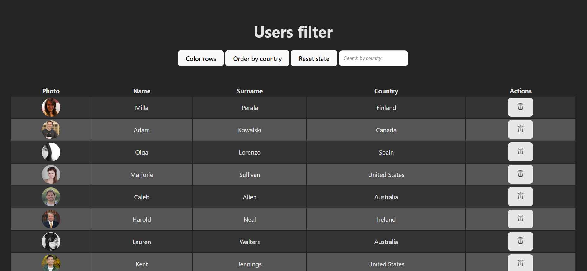

# Users filter

## React / TypeScript

<br>

<div align="center">
  
</div>

<br>

<div>

    User filter built with React and TypeScript.

</div>

<br>

**DEPLOY**: <br> https://users-filter-react.vercel.app

<br>
<br>

# Index

- [Users filter](#users-filter)
  - [React / TypeScript](#react--typescript)
- [Index](#index)
  - [Features](#features)
  - [Technologies and Tools used](#technologies-and-tools-used)
  - [Project Setup](#project-setup)
    - [Compile and Hot-Reload for Development](#compile-and-hot-reload-for-development)
    - [Compile and Minify for Production](#compile-and-minify-for-production)
    - [Lint with ESLint](#lint-with-eslint)
  - [Contribution](#contribution)
  - [Project Status](#project-status)
  - [Project Developer](#project-developer)

<br>

## Features

<div>

    ✔️ Display the data in a table format

    ✔️ Provide the option to color rows

    ✔️ Enable the ability to delete a row

    ✔️ Allows the user to restore the initial state,
       meaning that all deleted rows will be recovered

    ✔️ Allow the data to be sorted by country

    ✔️ Avoid sorting users again the data when the user
       is changing filter by country

    ✔️ Sort by clicking on the column header

</div>

<br>

## Technologies and Tools used

<div align="center">
  <br>
    <a href="https://reactjs.org/" target="_blank" rel="noreferrer"> </a>
    <a href="https://www.typescriptlang.org/" target="_blank" rel="noreferrer"> </a>
  <br>
  <br>
</div>

<br>

## Project Setup

```sh
npm install
```

### Compile and Hot-Reload for Development

```sh
npm run dev
```

### Compile and Minify for Production

```sh
npm run build
```

### Lint with [ESLint](https://eslint.org/)

```sh
npm run lint
```

<br>

## Contribution

If you want to contribute to this project, follow these steps:

1. Perform a fork to the repository.

2. Create a branch for your feature or bugfix: `git checkout -b feature/your-feature-name`

3. Make the necessary changes and commits: `git commit -m 'Add some feature'`

4. Push to branch: `git push origin feature/your-feature-name`

5. Send a pull request to the original repository.

<br>

## Project Status


<br>

## Project Developer

| [<br><sub>Kevin Schans</sub>](https://github.com/KevinVanDerSchans) |
| :--------------------------------------------------------------------------------------------------------------------------------------------: |
